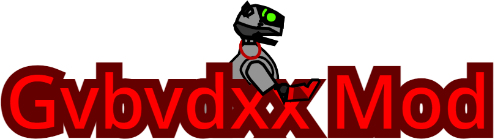

---

[Version List](versions)

## What is Gvbvdxx Mod?
Gvbvdxx Mod is made for people that want to keep using Scratch, but want more power and control over their projects, or trying to get quick code development, or just looking for something to make a small program out of without having to type lots of code.

## Why should I choose Gvbvdxx Mod?
Scratch is made for younger kids, and because it's targeted for young kids, it means that there is many limitations, however, Gvbvdxx Mod, is designed for older people while having backwards compatibility for Scratch Projects to be upgraded for more control and power.

## Is Gvbvdxx Mod safe?
Gvbvdxx Mod, alone is safe, however, if you don't trust a project, then don't run it, anything you make is directly ran on Gvbvdxx Mod 2 without any warnings, most projects should be safe, however, be alert for any dangerous projects, and warn anyone if they might fall for a dangerous project, this is the same for any package project as well, in fact, may be even more dangerous (since it's hard to tell if it is a Gvbvdxx Mod project).

## How do I package my projects?

Although we are currently working on making a newer packager with better and more accurate features, Gvbvdxx Mod already has an [earlier version](https://gvbmod.github.io/HTMLCompiler) of it but it has an outdated engine for the ealier project packager, so don't expect it to work right away with newer projects made in Gvbvdxx Mod 2. Instead, only use it for packaging Scratch projects.

If your interested in trying our [new project player](https://github.com/gvbmod/GvbvdxxMod2/tree/main/gm2-packager). You may try it using your command line, but you must have experience understanding how SB3 and JavaScript.

## What is the latest version?

You can check the [Version List](versions) for the latest version, the latest version should be on the top.
